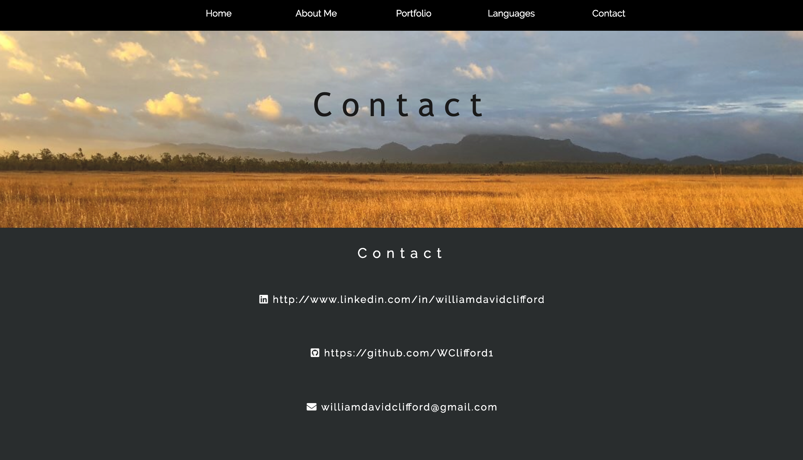

Please run src/portfolio.html to view the Portfolio page

https://github.com/WClifford1/Portfolio-Assessment

My portfolio website aims to provide 4 keys things to the user:
1: Information about myself
2: Information about my portfolio
3: Informaiton about the languages I know
4: My contact details

The entire content of the portfolio is delivered on one page. The user navigates to different sections of the page by either scrolling down or using the nav bar which is perminantly fixed to the top of the screen. The page is easy to navigate by scrolling as there are images and headers which seperate each section. On desktop the background images have a parallax quality which adds to the aesthetic appeal of the page. 

Target Audience:
The target audience for my portfolio is perspective employers.

Tech Stack:
HTML and CSS.
The toggle button for the navbar for mobile users utilizes an embedded jquery script to work.
The contact form uses an externally linked php file to work, the file is complete however is not linked to a server so does not currently function.

Userbility Considerations:
Two properties are changed on screens with a width of less than 700 pixels in order to increase responsivness for mobile users. The first change is that the nav bar is toggled with a button. The button is fixed to the top of the page. This allows the nav bar items to be much larger and easier to use for mobile users. The second change is that the parallax property of the background images is disabled in order to make scrolling less confusing for mobile users. To increase the accessibility of the site it uses only two fonts and suitible color contrast which makes the text easier to read, and uses appropiately named class and id tags to aid the use of screen-readers.

The planning process for making the website was quite difficult. I started with a completely different layout which I was working on for the majority of the allotted time, however, I was never quite satisfied with the result so I decided to completely remake the page. I tried a completely new style of layout of the portfolio which again I was not satisfied with so I restarted for a third time. For the third iteration I used the parallax scrolling layout which I was happy with and is what I used in the final product. By the time I started the parallax layout design there wasn't too much time left, so I had to prioritize less time planning and build most of the website as I went. The improvement that must occur in my future projects is to not spend too much time trying to make one design work before restarting completely.

Short Answer Q&A - Include short answers to the following questions,
Describe key events in the development of the internet from the 1980s to today (max. 150 words)

1982: Transmission Control Protocol (TCP) and Internet Protocol (IP) emerge as the protocol for ARPANET, which was one of the technologies that became the technical foundation of the Internet. 

1983: The Domain Name System (DNS) establishes the .edu, .gov, .com, .mil, .org, .net, and .int system for naming websites.

1990: HyperText Markup Language is developed by CERN.

1991: CERN introduces the World Wide Web to the public.

1995: amazon.com, Craiglist and eBay are launched.

1998: The Google search engine is launched.

1998: The Internet Protocol version 6 is introduced, which allows for 340 trillion trillion trillion unique addresses.

2000: The dot-com bubble bursts. Web sites such as Yahoo! and eBay are hit by a large-scale denial of service attack.

2004: Facebook launches and with it the era of online social-networking.

2010: Facebook reaches 400 million active users.

Define and describes the relationship between fundamental aspects of the internet such as: domains, web servers, DNS, and web browsers (max. 150 words)

The internet is a collection of networked computers. Web servers are computers which contain content such as websites. Web browsers are client applications which make requests to send and retrieve date from web servers.

When a web browser requests a URL from a web server, the browser needs to contact the Domain Name Service (DNS) to get the ip address related of the requested URL. 

To send and receive information, data is broken up into packets. Each packet contains binary data and the senders and receivers ip addresses.

Once the packets for the request have been received by the web server, the requested file is sent back to the web browser via packets, which are then reassembled by the web browser and presented to the user.

Reflect on one aspect of the development of internet technologies and how it has contributed to the world today (max. 150 words)

The development of social networking platforms and technologies has vastly contributed to the climate of the world we live in today. The rise of social networking has effected the geo-political arena with one example being instrumental role social-networking platforms played in the arab-spring, as protesters used social networking platforms to organize demonstrations and raise global aweness of events. 

One of the profound changes in the era of social networking to effect a large majority of useres is the way which in which news is received and shared. There are observations that indiciate that this is not always positive, as articles which contain false information are often shared without being cross-checked first.

